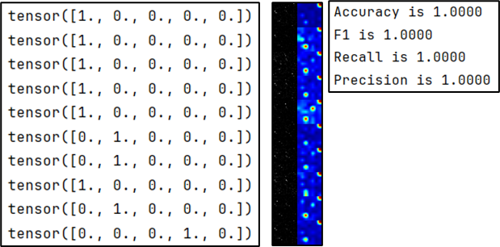

# Analyzing-RNA-Seq-Gene-Expression-Data-Using-Deep-Learning-Approaches-for-Cancer-Classification
Code reproduction for the paper: 

[Analyzing RNA-Seq Gene Expression Data Using Deep Learning Approaches for Cancer Classification]("https://www.mdpi.com/2076-3417/12/4/1850").

### Reproduction result

| **Code  Repdocution** |               |            |              |              | **Original** |              |
| --------------------- | ------------- | ---------- | ------------ | ------------ | ------------ | ------------ |
| **Model**             | **Precision** | **Recall** | **F1-Score** | **Accuracy** | **Model**    | **Accuracy** |
| CNN                   | 0.8564        | 0.8872     | 0.8658       | 0.9183       | CNN          | 0.9695       |
| AlexNet               | 0.877         | 0.9028     | 0.8824       | 0.9375       | AlexNet      | 0.931        |
| GoogleNet             | 0.8982        | 0.8916     | 0.8897       | 0.9362       | GoogleNet    | 0.9586       |
| VGG16                 | 0.9377        | 0.913      | 0.9219       | 0.9567       | VGG16        | 0.9287       |
| VGG19                 | 0.9541        | 0.9076     | 0.9061       | 0.9138       | VGG19        | 0.9109       |
| ResNet50              | 0.9688        | 0.9466     | 0.9691       | 0.9295       | ResNet50     | 0.9671       |
| ResNet101             | 0.899         | 0.9278     | 0.9055       | 0.9537       | ResNet101    | 0.9539       |
| ResNet152             | 0.8485        | 0.8525     | 0.8502       | 0.9103       | ResNet152    | 0.9478       |

### Example visualization

Add Grad CAM to visualize the RNA feature.

